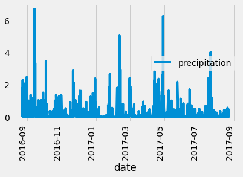
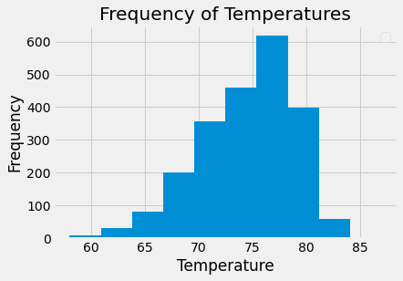
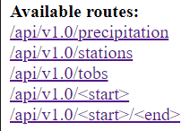
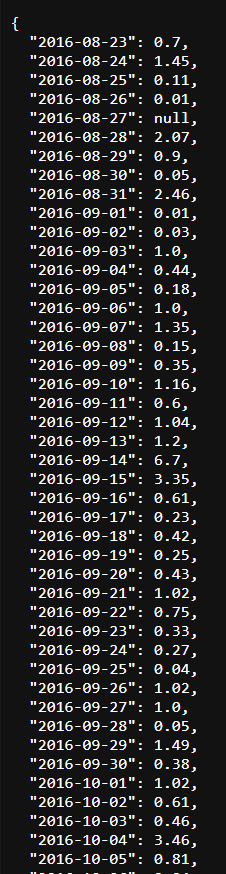
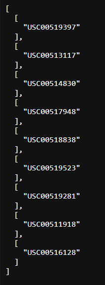
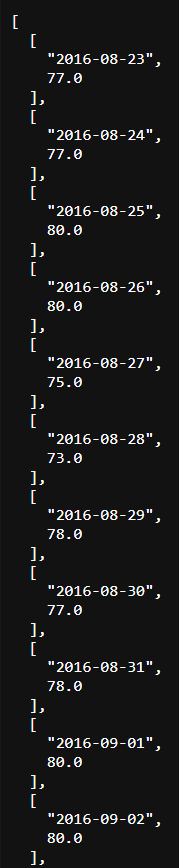
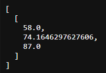
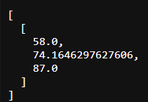

# sqlalchemy-challenge
Module 10 Challenge for the Vanderbilt Data Analytics Bootcamp

# Code from StackOverflow
The cells
```
# Using the most active station id from the previous query, calculate the lowest, highest, and average temperature.
# https://stackoverflow.com/questions/10941229/convert-list-of-tuples-to-list
# https://numpy.org/doc/stable/reference/generated/numpy.ravel.html
temperature = session.query(func.min(measurement.tobs), func.max(measurement.tobs), func.avg(measurement.tobs)).\
    filter(measurement.station == results[0][0]).all()
temperature = list(np.ravel(temperature))
temperature
```
and 
```
# Using the most active station id
# Query the last 12 months of temperature observation data for this station and plot the results as a histogram
twelve_months = session.query(measurement.tobs).\
    filter(measurement.date > year_from_last_date).\
    order_by(measurement.date).all()
# twelve_months is a list of tuples. We want it to be just a list, so we use ravel. 
twelve_months = np.ravel(twelve_months)
plt.xlabel("Temperature")
plt.ylabel("Frequency")
plt.title("Frequency of Temperatures")
plt.hist(twelve_months)
plt.show()
```
Use a function `ravel()`, which is explained on [this site](https://stackoverflow.com/questions/10941229/convert-list-of-tuples-to-list) and [this site](https://numpy.org/doc/stable/reference/generated/numpy.ravel.html). 

# Precipitation Analysis


# Station Analysis


# Climate App


The routes above give results similar to the following. 









